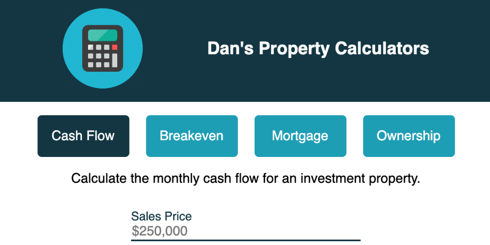

## Investment Property Calculators

<kbd></kbd>

This started as a project that was just going to be a calculator to determine the cash flow of a potential investment property. It expanded to include the following functions:

- Calculate the monthly cash flow of a potential investment property;
- Calculate the purchase price of an investment property that would give a \$0/month cash flow, and additionally a purchase price with a set cash flow amount;
- Calculate the monthly mortgage payment for a property; and
- Determine overall monthly ownership costs of a property.

The project is built on a homemade Gulp platform and Sass (SCSS).
